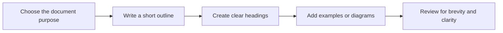

# Writing documentation files

This instruction file explains how to write documentation files in Markdown. The guidance in this file applies only to Markdown documentation files and not to other file types.

The goal is to make documentation easy to read, easy to scan, and easy to understand for readers who may not be native English speakers or may not be technical experts.

## What this file covers

- How to structure a Markdown document.
- How to write clearly and briefly.
- How to reduce noise and vague language.
- How to use visual elements such as tables and diagrams.

## Keep it simple and helpful

Use short sentences and short paragraphs. Write as if you are helping someone who is new to the topic.

- Use plain words instead of fancy words.
- Use active voice: say who does what.
- Use second person when you give instructions: use "you".
- Avoid jargon and buzzwords.
- Avoid filler phrases like "in order to", "as a matter of fact", and "please note".

### Language examples

| Better | Worse |
| --- | --- |
| Use a template to share the same settings. | In order to share the same settings, you should consider using a template. |
| Store sensitive values in a secure location. | It is recommended that you store sensitive values in a secure location when possible. |

## Start with a clear purpose

Each Markdown file should answer one or two main questions. Ask yourself:

- Who is this document for?
- What should the reader do or learn?
- What is the most important point?

When the purpose is clear, the document is easier to follow.

## Use structure that helps scanning

Good structure makes documents easier to scan. Use headings, lists, and tables instead of long blocks of text.

### Recommended structure

1. Summary or purpose
2. Why it matters
3. When to use it
4. Examples
5. Notes or exceptions

### Heading rules

- Use sentence case for headings.
- Use one `#` heading per page.
- Use `##` for major sections and `###` for subsections.
- Make headings descriptive.
- Do not use headings only to make text look bigger.

### Markdown formatting

- Use inline code formatting with backticks for filenames, commands, variable names, and code fragments.
- Use fenced code blocks for examples and include the language when possible.
- Use bold for interface elements or important terms, and use italics sparingly for emphasis only.
- Use tables for comparisons, options, or structured data, not for layout or visual styling.
- Avoid raw HTML in Markdown files unless the rendering target requires it.
- Use consistent Bullet and numbered list styles, and keep lists short and scannable.

### Link text

- Use descriptive link text that explains where the link goes or what the reader will find.
- Avoid generic link text such as `click here`, `read more`, or `see this`.
- Prefer natural phrasing: `For more detail, see [Markdown link best practices](link).`
- Do not put links in headings; put link text in body copy instead.
- Use relative links for documentation within the repository when possible.

### Heading examples

Bad heading:

```markdown
## Notes
```

Better heading:

```markdown
## When to use a shared template
```

## Reduce cognitive load with clear visuals

Visual elements are helpful when they explain a structure or process. Use them when they make the information easier to understand.

### Use tables for comparison

Tables work well for showing differences, options, or rules.

### Use code blocks for examples

Show concrete examples in Markdown or YAML code blocks. Always explain what the example shows.

### Use diagrams for flow or structure

Use simple diagrams when a process is hard to explain in text. Use Mermaid when needed. Use tools and syntax supported by the target Markdown renderer. For Azure DevOps, prefer `graph LR` instead of `flowchart LR`.



## Avoid noise and vague language

Remove extra words and any phrase that does not add meaning. Avoid words like:

- basically
- frankly
- simply
- obviously
- hopefully
- very
- quite

Replace vague terms with concrete terms.

### Language noise examples

Bad:

> You should usually use the Azure DevOps pipeline template when possible.

Better:

> Use the shared template when the same content is reused in more than one document.

## Use examples early

Show at least one example near the top of the document. Examples help readers understand quickly. If the document is a guideline, include both a bad example and a good example when possible.

## Write for global readers

Many readers are not native English speakers. Write in a way that is easy to translate and easy to understand.

- Use standard American spelling.
- Avoid idioms and slang.
- Avoid culture-specific references.
- Avoid long sentences.
- Use one idea per sentence.

## Review and revise

Great documentation is usually rewritten. After writing, do these checks:

- Does the first sentence explain the main idea?
- Does each heading describe the section clearly?
- Can any sentence be shorter?
- Is there any jargon that can be removed?
- Are examples concrete and realistic?

## Useful sources

- [Google developer documentation style guide](https://developers.google.com/style)
- [Microsoft Writing Style Guide](https://learn.microsoft.com/en-us/style-guide/)
- [On Writing Well](https://www.goodreads.com/book/show/16149296-on-writing-well)
- [Smart Brevity](https://www.goodreads.com/book/show/65389153-smart-brevity)

## How to use this instruction file

This file is a reference for writing Markdown documentation in this repository. When you write a new doc, follow these principles and link to the sources above for more detail.